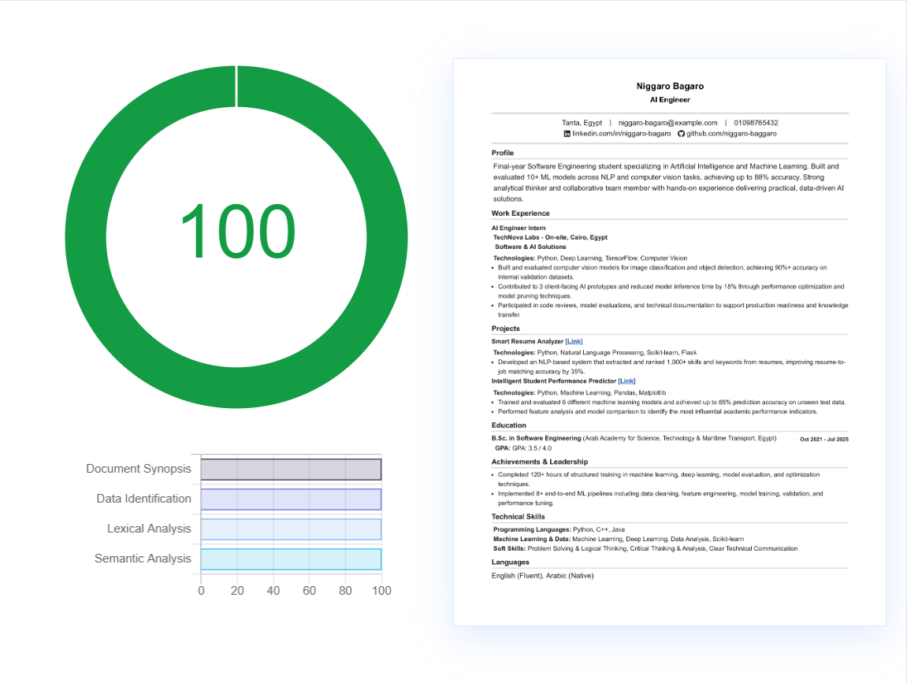
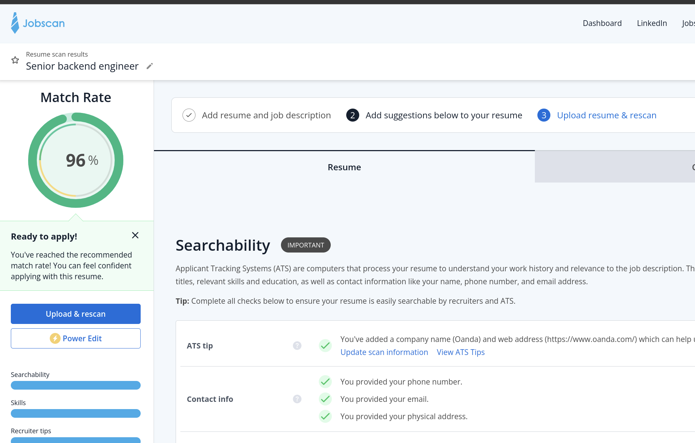
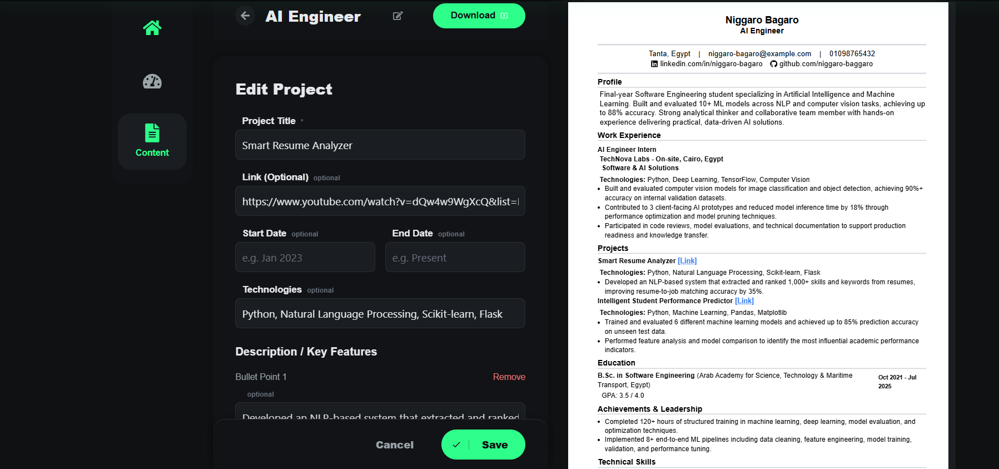
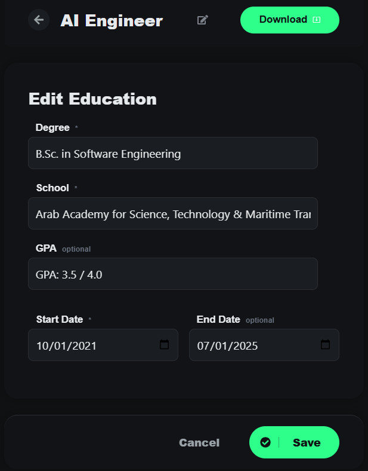
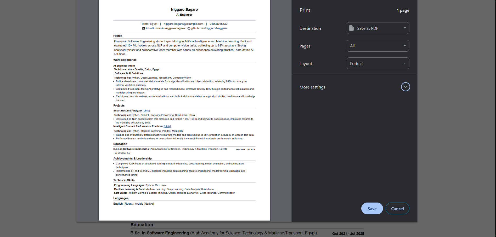
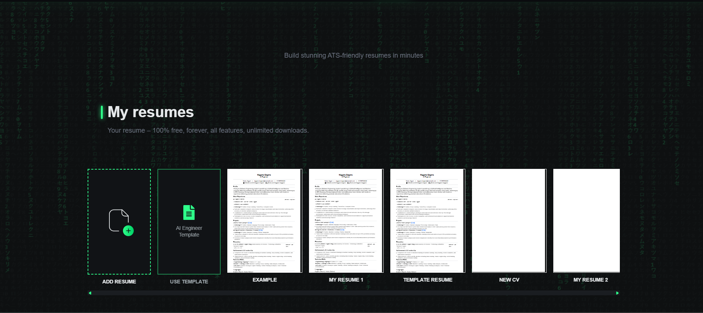
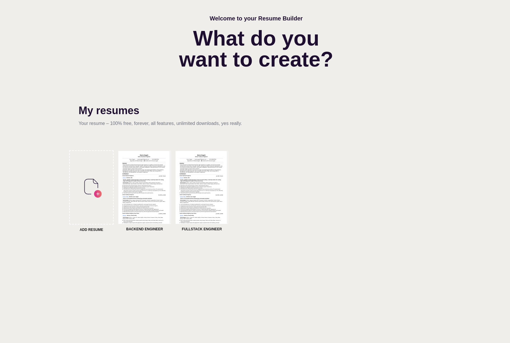
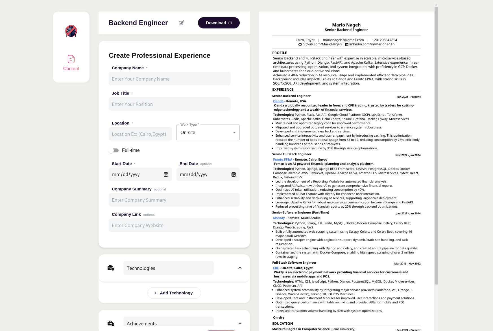
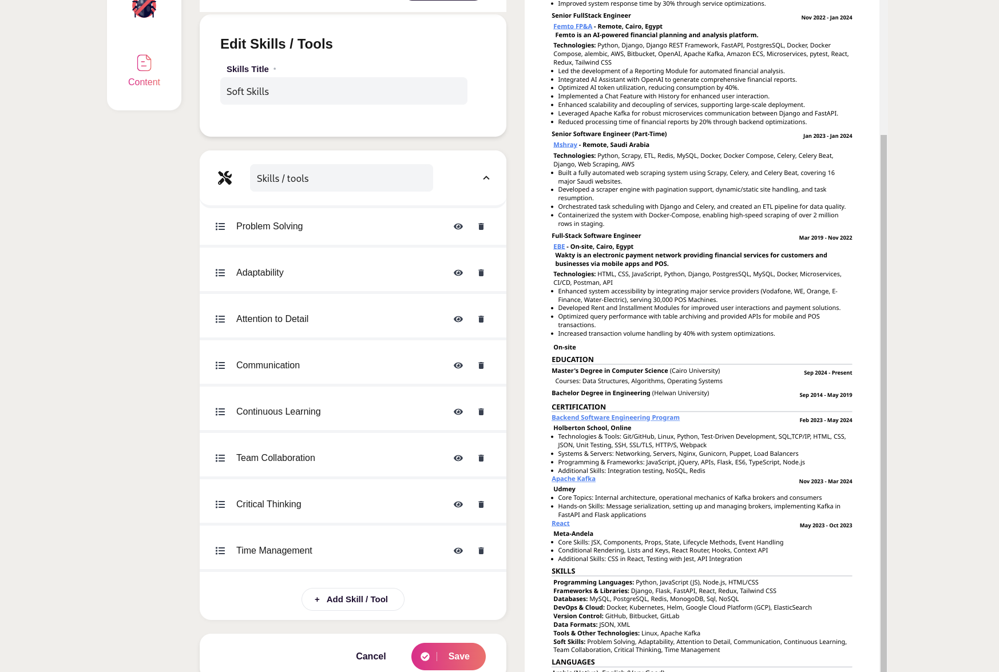

# Ready For Hire - ATS Cracker 

## Description
This Is CV-Builder in very easy way with the best template to make your CV look professional and attractive. It also written in way that it can be easily parsed by ATS (Applicant Tracking System) which is used by many companies to filter out the CVs.

## Features
- User can create their CV in very easy way.
- User can download their CV in PDF format.
- Your Cv Now Is ATS Friendly.
- Your Cv Now Json Object thats mean you easily edit it with any editor or 
make any [AI] help to optimize it , fix grammar or any other thing.
- you can get your CV in JSON format from the right side of the engine or you can download it in PDF format.
- you can paste your CV in the engine and it will parse it and show you the result in the right side of the engine.

- all The View Is Responsive ,  You Can Reorder almost all the sections in the CV
but [Important] to keep the order of the sections in the same order as the original order in the CV.

- there a nice admin panel to manage the users and the CVs, you can visit it by going to `/admin` and login with the superuser you created in the first time you run the project.

## Technologies
- Next.js
- Python
- Django
- Django Rest Framework
- Tailwind CSS
- Docker
- Docker Compose
- Nginx

## Installation
- Clone the repository
- Run `docker-compose up --build` to build the images and run the containers
- Open your browser and go to `http://127.0.0.1:8861`
- Create an Account , You Will Have Example CV to start with

- Optional: To access the admin panel go to `http://127.0.0.1:8861/admin/` and login with the superuser you created in the first time you run the project

Screenshot:

## CV Sections
- Personal Information
- Summary
- Work Experience
- Education
- Certifications / Courses
- Skills
- Languages

